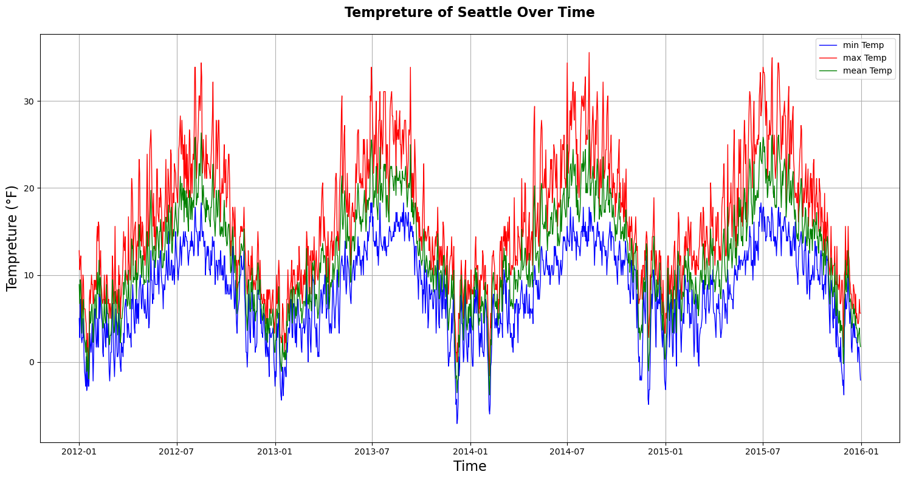
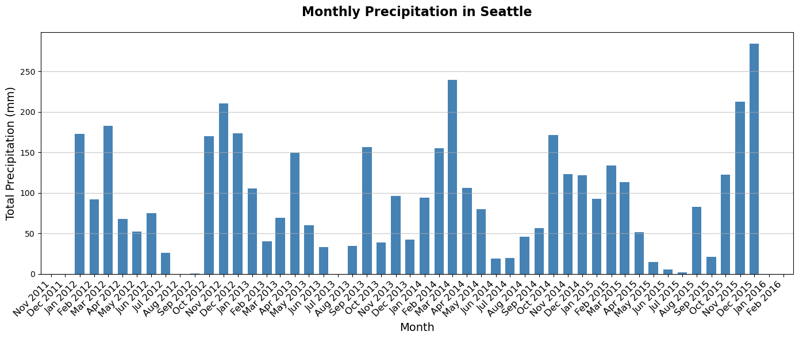
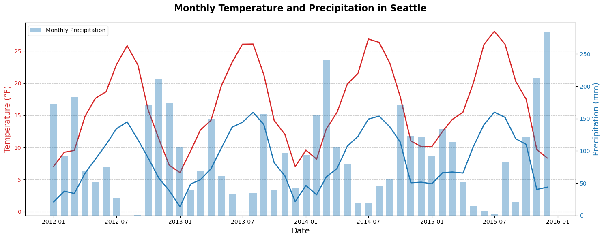
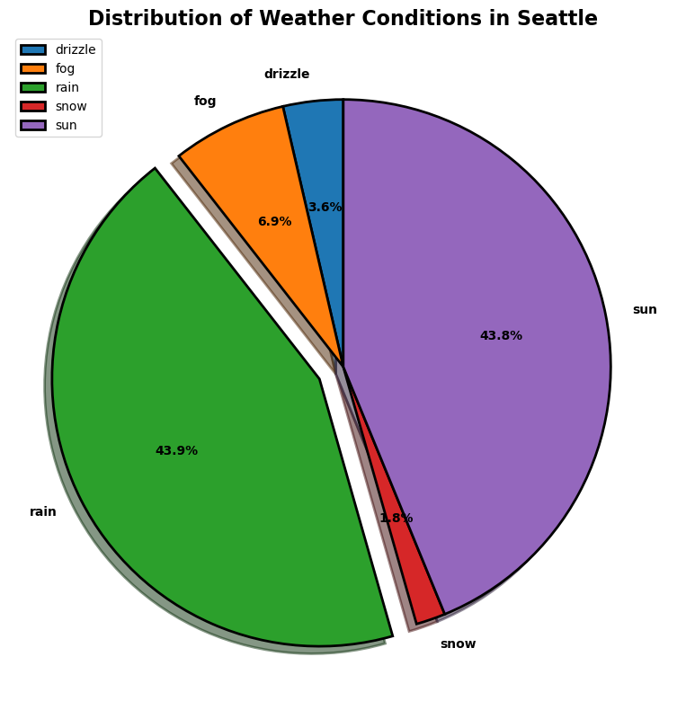
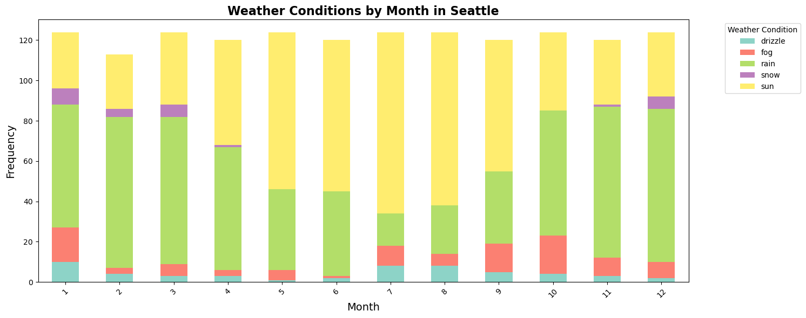
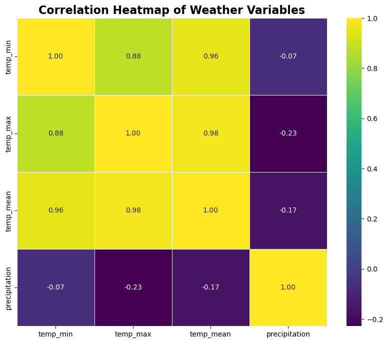

# **Seattle Weather Analysis**


## **Introduction**
Hello! My name is **Adel Abbaszare**, and I am a Computer Engineering student with a deep passion for **data analysis, data processing**, and the fascinating fields of **Artificial Intelligence (AI) and Machine Learning (ML)**. I enjoy exploring data to uncover meaningful insights and building solutions that leverage AI and ML to solve real-world problems.

This project was created as part of my Artificial Intelligence lab course under the guidance of my professor, **Mrs.Fahimeh Banavi**. The goal of the project is to demonstrate how fundamental Python libraries can be used to analyze and visualize real-world datasets.

## **About the Project**

This notebook focuses on the analysis and visualization of **Seattle city weather data** using Python. The goal is to explore weather patterns, understand seasonal variations, and derive meaningful insights through data analysis.

In this repository, we utilize Jupyter Notebook for performing the analysis interactively. The project demonstrates how to clean, manipulate, and visualize data effectively using core Python libraries. Specifically, we rely on the following:

- **Pandas:** For data manipulation and cleaning, including handling dates, numerical operations, and grouping.
- **NumPy:** For efficient numerical computations and handling arrays.
- **Matplotlib:** For creating clear and visually appealing charts, such as pie charts, bar graphs, and heatmaps.
- **Seaborn:** To generate advanced plots like heatmaps and enhance overall visual appeal.
- **Kagglehub:** For downloading datasets directly from Kaggle repositories
The combination of these libraries allows us to handle complex datasets while keeping the codebase simple and efficient.

## **Project Objectives**
The primary objectives of this notebook are as follows:

1. **Explore the Dataset:** Understand the structure, data types, and statistical properties of the Seattle weather dataset.
2. **Clean and Prepare the Data:** Handle missing values, convert data types, and engineer new features to enhance analysis.
3. **Analyze Weather Conditions:** Gain insights into the frequency of different weather types (e.g., rainy, sunny, snowy) and their distribution over time.
4. **Identify Correlations:** Examine relationships between key variables such as temperature and precipitation using correlation analysis and heatmaps.
5. **Visualize Findings:** Create clear and informative visualizations to make the data easier to interpret, such as pie charts, bar charts, and heatmaps.

## **Setting Up the Environment**
Before diving into the analysis, ensure your environment is set up with the required Python libraries. This repository includes a `requirements.txt` file that lists all the dependencies. To install them, follow these steps:

1. Clone this repository to your local machine.
2. Navigate to the repository folder using your terminal or command prompt.
3. Run the following command to install all required libraries:
```
pip install -r requirements.txt
```
Once the dependencies are installed, open the Jupyter Notebook in your preferred environment (e.g., Jupyter Notebook, JupyterLab, or VS Code) and start exploring the dataset.

## **Workflow of the Notebook**
**1. Data Loading:**
- The dataset is sourced from Kaggle using the **Kagglehub** library. This ensures that the data is directly downloaded and ready for analysis.
- The data is then loaded into a Pandas DataFrame for manipulation.

**2. Data Cleaning and Transformation:**
- Convert the "date" column to a proper datetime format for time-based analysis.
- Handle missing or invalid entries in numeric columns by converting them to `NaN`.
- Engineer a new column, `temp_mean`, to represent the average temperature for each day.


**3. Exploratory Data Analysis (EDA):**
- Perform statistical analysis on temperature and precipitation.
- Group data by weather types (e.g., rainy, sunny) to calculate averages and frequencies.
- Create a monthly summary of weather conditions to understand seasonal patterns.


**4. Visualization:**
- Use Matplotlib and Seaborn to create compelling visualizations, including:
  -   Pie charts for the distribution of weather types.
  -   Bar charts to compare monthly trends in weather conditions.
  -   Heatmaps to reveal correlations between temperature and precipitation variables.
 
Let’s dive into the notebook and uncover the weather trends in Seattle!

## **Download the raw Seattle weather dataset from Kaggle**
In this step, we focus on obtaining the raw Seattle weather dataset directly from Kaggle, which serves as the foundation for our analysis. The dataset contains detailed weather observations for Seattle over several years, including temperature, precipitation, and weather conditions, making it ideal for both data analysis and visualization.

To automate the process, we utilize the **Kagglehub** library, which simplifies downloading datasets from Kaggle repositories. Ensure you have the **Kaggle API** key configured on your system for seamless access to the dataset.

**Important Note:**
- If you are a resident of Iran or any region with restricted access to Kaggle, you may need to enable a VPN to bypass regional restrictions.
- Alternatively, if you encounter any issues with automated downloads, you can manually download the dataset using the link below:

**[Weather Prediction Dataset on Kaggle](https://www.kaggle.com/datasets/ananthr1/weather-prediction)**

**Steps for Manual Download:**
- Click on the link above to navigate to the dataset page.
- Log in to your Kaggle account.
- Download the dataset as a `.csv` file to your local system.
Place the downloaded file in the working directory where this notebook resides.
Once the dataset is downloaded, you can proceed to the next steps to load and preprocess the data for analysis. This ensures that even with potential download restrictions, you can still follow the workflow without interruptions.


```python
import kagglehub

# Downloading seattle weather dataset from Kaggle
path = kagglehub.dataset_download("ananthr1/weather-prediction")
print("Path to dataset files:", path)
```

    Path to dataset files: C:\Users\SarayeTell\.cache\kagglehub\datasets\ananthr1\weather-prediction\versions\1
    

## **Reading Dataset**
After downloading the dataset, the first step is to load it and inspect its structure. For this, we use **Pandas**, a powerful Python library for data manipulation and analysis.

### **Loading and Exploring the Dataset**
1. **Loading the Data:**
The dataset, stored in CSV format, is read into a Pandas DataFrame using `pd.read_csv()`. This provides a structured format for accessing and analyzing the data.

2. **Initial Inspection:**
   - **`df.info():`** Summarizes the dataset by showing the total rows, columns, non-null values, and data types (`dtype`) for each column. This helps identify missing or inconsistent values.
   - **`df.head():`** Displays the first few rows, offering a quick preview of the dataset's structure.

3. **Statistical Summary:**

   - The `df.describe()` method provides key statistics for numerical columns, such as mean, standard deviation, and range (min and max values). These metrics help identify patterns, outliers, and potential data quality issues.

### **Object-Oriented Programming (OOP) Approach**
This notebook follows an **OOP design** to enhance code reusability and modularity. A custom class encapsulates methods for data loading, cleaning, and transformation. Users can easily specify the dataset’s directory path when initializing the class, making it adaptable to different datasets with minimal effort.

### **Benefits of This Approach:**
- **Modular Design:** Code is well-organized and reusable for similar projects.
- **Flexibility:** Works with other datasets by simply updating the file path.
- **Maintainability:** Methods are cleanly separated for easy debugging and extension.

With the data successfully loaded and inspected, the next step involves preparing it for deeper analysis and visualization. Let’s proceed


```python
import pandas as pd

class reading_dataset:
    
    def __init__(self, folder_path):
        self.folder_path = folder_path

    
    def read(self):
        df = pd.read_csv(self.folder_path)
        return df

    
    def information(self, df):
        df = pd.DataFrame(df)
        print("Display the Seattle weather dataset :")
        display(df)

        print("--"*30)
        print("Non-null count and dtype of each columns :")
        display(df.info())
        
        print("--"*30)
        print("Describe some statictics information of dataset :")
        display(df.describe())

        print("--"*30)
        print("Data type of each column :")
        display(df.dtypes)
        

# path to seattle weather dataset
dataset = reading_dataset(r"C:\Users\SarayeTell\Desktop\Weather Prediction\seattle-weather.csv")

# Read the dataset
df = dataset.read()

# Display dataset information
dataset.information(df)
```

Display the Seattle weather dataset :
    
<table border="1" class="dataframe">
  <thead>
    <tr style="text-align: right;">
      <th></th>
      <th>date</th>
      <th>precipitation</th>
      <th>temp_max</th>
      <th>temp_min</th>
      <th>wind</th>
      <th>weather</th>
    </tr>
  </thead>
  <tbody>
    <tr>
      <th>0</th>
      <td>2012-01-01</td>
      <td>0.0</td>
      <td>12.8</td>
      <td>5.0</td>
      <td>4.7</td>
      <td>drizzle</td>
    </tr>
    <tr>
      <th>1</th>
      <td>2012-01-02</td>
      <td>10.9</td>
      <td>10.6</td>
      <td>2.8</td>
      <td>4.5</td>
      <td>rain</td>
    </tr>
    <tr>
      <th>2</th>
      <td>2012-01-03</td>
      <td>0.8</td>
      <td>11.7</td>
      <td>7.2</td>
      <td>2.3</td>
      <td>rain</td>
    </tr>
    <tr>
      <th>3</th>
      <td>2012-01-04</td>
      <td>20.3</td>
      <td>12.2</td>
      <td>5.6</td>
      <td>4.7</td>
      <td>rain</td>
    </tr>
    <tr>
      <th>4</th>
      <td>2012-01-05</td>
      <td>1.3</td>
      <td>8.9</td>
      <td>2.8</td>
      <td>6.1</td>
      <td>rain</td>
    </tr>
    <tr>
      <th>...</th>
      <td>...</td>
      <td>...</td>
      <td>...</td>
      <td>...</td>
      <td>...</td>
      <td>...</td>
    </tr>
    <tr>
      <th>1456</th>
      <td>2015-12-27</td>
      <td>8.6</td>
      <td>4.4</td>
      <td>1.7</td>
      <td>2.9</td>
      <td>rain</td>
    </tr>
    <tr>
      <th>1457</th>
      <td>2015-12-28</td>
      <td>1.5</td>
      <td>5.0</td>
      <td>1.7</td>
      <td>1.3</td>
      <td>rain</td>
    </tr>
    <tr>
      <th>1458</th>
      <td>2015-12-29</td>
      <td>0.0</td>
      <td>7.2</td>
      <td>0.6</td>
      <td>2.6</td>
      <td>fog</td>
    </tr>
    <tr>
      <th>1459</th>
      <td>2015-12-30</td>
      <td>0.0</td>
      <td>5.6</td>
      <td>-1.0</td>
      <td>3.4</td>
      <td>sun</td>
    </tr>
    <tr>
      <th>1460</th>
      <td>2015-12-31</td>
      <td>0.0</td>
      <td>5.6</td>
      <td>-2.1</td>
      <td>3.5</td>
      <td>sun</td>
    </tr>
  </tbody>
</table>
<p>1461 rows × 6 columns</p>
</div>


  ------------------------------------------------------------
  Non-null count and dtype of each columns :
    <class 'pandas.core.frame.DataFrame'>
    RangeIndex: 1461 entries, 0 to 1460
    Data columns (total 6 columns):
     #   Column         Non-Null Count  Dtype  
    ---  ------         --------------  -----  
     0   date           1461 non-null   object 
     1   precipitation  1461 non-null   float64
     2   temp_max       1461 non-null   float64
     3   temp_min       1461 non-null   float64
     4   wind           1461 non-null   float64
     5   weather        1461 non-null   object 
    dtypes: float64(4), object(2)
    memory usage: 68.6+ KB
    None
------------------------------------------------------------
Describe some statictics information of dataset :

<div>
<style scoped>
    .dataframe tbody tr th:only-of-type {
        vertical-align: middle;
    }

    .dataframe tbody tr th {
        vertical-align: top;
    }

    .dataframe thead th {
        text-align: right;
    }
</style>
<table border="1" class="dataframe">
  <thead>
    <tr style="text-align: right;">
      <th></th>
      <th>precipitation</th>
      <th>temp_max</th>
      <th>temp_min</th>
      <th>wind</th>
    </tr>
  </thead>
  <tbody>
    <tr>
      <th>count</th>
      <td>1461.000000</td>
      <td>1461.000000</td>
      <td>1461.000000</td>
      <td>1461.000000</td>
    </tr>
    <tr>
      <th>mean</th>
      <td>3.029432</td>
      <td>16.439083</td>
      <td>8.234771</td>
      <td>3.241136</td>
    </tr>
    <tr>
      <th>std</th>
      <td>6.680194</td>
      <td>7.349758</td>
      <td>5.023004</td>
      <td>1.437825</td>
    </tr>
    <tr>
      <th>min</th>
      <td>0.000000</td>
      <td>-1.600000</td>
      <td>-7.100000</td>
      <td>0.400000</td>
    </tr>
    <tr>
      <th>25%</th>
      <td>0.000000</td>
      <td>10.600000</td>
      <td>4.400000</td>
      <td>2.200000</td>
    </tr>
    <tr>
      <th>50%</th>
      <td>0.000000</td>
      <td>15.600000</td>
      <td>8.300000</td>
      <td>3.000000</td>
    </tr>
    <tr>
      <th>75%</th>
      <td>2.800000</td>
      <td>22.200000</td>
      <td>12.200000</td>
      <td>4.000000</td>
    </tr>
    <tr>
      <th>max</th>
      <td>55.900000</td>
      <td>35.600000</td>
      <td>18.300000</td>
      <td>9.500000</td>
    </tr>
  </tbody>
</table>
</div>


------------------------------------------------------------
  Data type of each column :
    date              object
    precipitation    float64
    temp_max         float64
    temp_min         float64
    wind             float64
    weather           object
    dtype: object


## **Convert the date column dtype from object to datetime**
In the previous code, we'll see data type of each columns using `pd.dtype` attribute. You can see the dtpye of date and weather is known as object.  For date column, if we want to analysis by time, we need to change and convert data type of date column to datetime using `pd.to_datetime` attribute.  So in this cell, we convert the data type of date column from object to datetime with `%Y-%m-%d` format.  The format string `%Y-%m-%d` is used in python to define how date strings should be interpreted or displayed. Each component represents a part of the date:  
- **Explanation of "%Y-%M-%d"**
  - `%Y` : Represents the year in a four-digit format (e.g., 2024).
  - `%m` : Represents the month in two digits (01-12).
  - `%d` : Represents the day of the month (01-31).

**Example of common date format**  
Here are examples of different date formats and their format strings:  

| **Format String**    | **Example**               | **Description**                          |
|----------------------|---------------------------|------------------------------------------|
| `%Y-%m-%d`           | `2024-11-28`              | ISO standard date format                |
| `%d-%m-%Y`           | `28-11-2024`              | European date format                    |
| `%m/%d/%Y`           | `11/28/2024`              | US date format                          |
| `%B %d, %Y`          | `November 28, 2024`       | Full month name, day, and year          |
| `%d %b %Y`           | `28 Nov 2024`             | Abbreviated month name                  |
| `%A, %B %d, %Y`      | `Thursday, November 28, 2024` | Full weekday name, full month name, day, and year |
 |


```python
import pandas as pd

class reading_dataset:
    
    def __init__(self, folder_path):
        self.folder_path = folder_path

    
    def read(self):
        df = pd.read_csv(self.folder_path)
        return df


    def convert_date_column(self, df):
        df = pd.DataFrame(df)
        df["date"] = pd.to_datetime(df["date"], format = '%Y-%m-%d')
        display(df.dtypes)


dataset = reading_dataset(r"C:\Users\SarayeTell\Desktop\Weather Prediction\seattle-weather.csv")

# Read the dataset
df = dataset.read()

# Display dtypes of columns
dataset.convert_date_column(df)
```


    date             datetime64[ns]
    precipitation           float64
    temp_max                float64
    temp_min                float64
    wind                    float64
    weather                  object
    dtype: object


## **Adding a new column to dataset (mean Tempreture) and visualize the Tempreture and Precipitation**  
In this cell, we use the Matplotlib library, a powerful Python library for creating static, animated, and interactive visualizations. Matplotlib provides users with tools and functionality to graphically represent data, making it easier to analyze and understand.

Additionally, in the `add_mean_temp_column` function, we add a new column named `mean_temp`, which calculates the average of `min_temp` and `max_temp`.

In the `visualize_dataset_temp` function, we create a line graph to display the daily variations in `min_temp`, `max_temp`, and `mean_temp` over time, sorting the data by the date column.

Next, the `visualize_dataset_precipitation` function visualizes the total precipitation for each month over time (from `January 2012` to `December 2015`).

Finally, the `visualize_precipitation_temp` function combines the previous graphs, showing the monthly averages of minimum and maximum temperatures alongside the total precipitation for each month.


```python
import pandas as pd
import matplotlib.pyplot as plt
import matplotlib.dates as mdates

class reading_dataset:
    
    def __init__(self, folder_path):
        self.folder_path = folder_path

    
    def read(self):
        df = pd.read_csv(self.folder_path)
        return df

    
    def convert_date_column(self, df):
        df = pd.DataFrame(df)
        df["date"] = pd.to_datetime(df["date"], format = '%Y-%m-%d')
        #display(df.dtypes)
        return df

    
    def add_mean_temp_column(self, df):
        # add new column named 'temp_mean' that mean tempreture of 'temp_min' & 'temp_max' columns
        df['temp_mean'] = (df['temp_max'] + df['temp_min']) / 2

        # move 'temp_mean' column to spesific position (index 4)
        df.insert(4, 'temp_mean', df.pop('temp_mean'))
        display(df.head())
        return df


    def visualize_dataset_temp(self, df):
        df.sort_values('date', inplace = True)
        plt.figure(figsize=(15, 8))
        plt.plot(df['date'], df['temp_min'], label="Min Temp", color='blue', linewidth=1)
        plt.plot(df['date'], df['temp_max'], label="Max Temp", color='red', linewidth=1)
        plt.plot(df['date'], df['temp_mean'], label="Mean Temp", color='green', linewidth=1)
        plt.title("Tempreture of Seattle Over Time", fontsize = 16, fontweight = 'bold', pad = 20)
        plt.xlabel('Time', fontsize = 16)
        plt.ylabel("Tempreture (°F)", fontsize = 16)
        plt.tight_layout()
        plt.legend(["min Temp", "max Temp", "mean Temp"],  loc = 'best')
        plt.grid()
        plt.show()


    def visualize_dataset_precipitation(self, df):

        df_monthly = df.groupby(df['date'].dt.to_period('M')).agg({'precipitation': 'sum'}).reset_index()
        
        df_monthly['date'] = df_monthly['date'].dt.to_timestamp()

        plt.figure(figsize=(14, 6))
    
        plt.bar(df_monthly['date'], df_monthly['precipitation'], color='steelblue', width=20)
    
        plt.title("Monthly Precipitation in Seattle", fontsize=16, fontweight='bold', pad=20)
        plt.xlabel('Month', fontsize=14)
        plt.ylabel('Total Precipitation (mm)', fontsize=14)
    
        plt.grid(True, axis='y', linestyle='-', linewidth=1, alpha=0.6)
    
        plt.xticks(rotation=45, ha='right', fontsize=12)
        plt.gca().xaxis.set_major_formatter(mdates.DateFormatter('%b %Y'))  # Month and Year format
        plt.gca().xaxis.set_major_locator(mdates.MonthLocator())  # Major ticks at monthly intervals
        plt.tight_layout()
        plt.show()

    
    def visualize_precipitation_temp(self, df):
        
        # Group data by month and calculate monthly totals for precipitation
        df_monthly = df.groupby(df['date'].dt.to_period('M')).agg({
            'precipitation': 'sum',
            'temp_max': 'mean',  # Monthly average max temperature
            'temp_min': 'mean'   # Monthly average min temperature
        }).reset_index()
    
        df_monthly['date'] = df_monthly['date'].dt.to_timestamp()

        fig, ax1 = plt.subplots(figsize=(15, 6))
    
        # Plot temperature on the first y-axis
        ax1.set_xlabel('Date', fontsize=14)
        ax1.set_ylabel('Temperature (°F)', color='tab:red', fontsize=14)
        ax1.plot(df_monthly['date'], df_monthly['temp_max'], label='Max Temp', color='tab:red', linewidth=2)
        ax1.plot(df_monthly['date'], df_monthly['temp_min'], label='Min Temp', color='tab:blue', linewidth=2)
        ax1.tick_params(axis='y', labelcolor='tab:red')
    
        # Plot monthly precipitation on the second y-axis
        ax2 = ax1.twinx()
        ax2.set_ylabel('Precipitation (mm)', color='tab:blue', fontsize=14)
        ax2.bar(df_monthly['date'], df_monthly['precipitation'], label='Monthly Precipitation', color='tab:blue', alpha=0.4, width=20)
        ax2.tick_params(axis='y', labelcolor='tab:blue')
    
        plt.title('Monthly Temperature and Precipitation in Seattle', fontsize=16, fontweight='bold', pad=20)
        plt.xticks(rotation=45, ha='right', fontsize=12)
    
        ax1.grid(True, axis='y', linestyle='--', alpha=0.6)
        fig.tight_layout()
        plt.legend()
        plt.show()


dataset = reading_dataset(r"C:\Users\SarayeTell\Desktop\Weather Prediction\seattle-weather.csv")
df = dataset.read()
df = dataset.convert_date_column(df)
df = dataset.add_mean_temp_column(df)
dataset.visualize_dataset_temp(df)
dataset.visualize_dataset_precipitation(df)
dataset.visualize_precipitation_temp(df)
```


<div>
<style scoped>
    .dataframe tbody tr th:only-of-type {
        vertical-align: middle;
    }

    .dataframe tbody tr th {
        vertical-align: top;
    }

    .dataframe thead th {
        text-align: right;
    }
</style>
<table border="1" class="dataframe">
  <thead>
    <tr style="text-align: right;">
      <th></th>
      <th>date</th>
      <th>precipitation</th>
      <th>temp_max</th>
      <th>temp_min</th>
      <th>temp_mean</th>
      <th>wind</th>
      <th>weather</th>
    </tr>
  </thead>
  <tbody>
    <tr>
      <th>0</th>
      <td>2012-01-01</td>
      <td>0.0</td>
      <td>12.8</td>
      <td>5.0</td>
      <td>8.90</td>
      <td>4.7</td>
      <td>drizzle</td>
    </tr>
    <tr>
      <th>1</th>
      <td>2012-01-02</td>
      <td>10.9</td>
      <td>10.6</td>
      <td>2.8</td>
      <td>6.70</td>
      <td>4.5</td>
      <td>rain</td>
    </tr>
    <tr>
      <th>2</th>
      <td>2012-01-03</td>
      <td>0.8</td>
      <td>11.7</td>
      <td>7.2</td>
      <td>9.45</td>
      <td>2.3</td>
      <td>rain</td>
    </tr>
    <tr>
      <th>3</th>
      <td>2012-01-04</td>
      <td>20.3</td>
      <td>12.2</td>
      <td>5.6</td>
      <td>8.90</td>
      <td>4.7</td>
      <td>rain</td>
    </tr>
    <tr>
      <th>4</th>
      <td>2012-01-05</td>
      <td>1.3</td>
      <td>8.9</td>
      <td>2.8</td>
      <td>5.85</td>
      <td>6.1</td>
      <td>rain</td>
    </tr>
  </tbody>
</table>
</div>


    

    


    

    


    

    


## **Distribution of weather condition in Seattle**
In this analysis, we aim to examine the frequency of different weather conditions in Seattle by counting the unique days associated with each condition. This provides insights into the percentage of days classified as rainy, sunny, snowy, and other conditions over a specific period.

To visualize this distribution, a pie chart was used, highlighting the proportion of each weather condition in the Seattle weather dataset. The dataset spans from `January 2012` to `December 2015`, covering several years of weather data. The chart allows for an intuitive understanding of how often each weather type occurred during this time.

From the visualization, we observe that **rainy weather** accounts for approximately **43.9% of the total days**, making it the most common condition. Interestingly, **sunny weather** closely follows, representing about **43.8%** of the days. This near parity between sunny and rainy days emphasizes Seattle's balanced mix of clear and rainy weather. Other conditions, such as snowy or cloudy days, make up a smaller proportion of the overall distribution.

This breakdown of weather conditions provides valuable information for understanding Seattle's climate patterns, offering useful context for residents, businesses, and urban planners alike.


```python
import pandas as pd
import matplotlib.pyplot as plt

class reading_dataset:
    
    def __init__(self, folder_path):
        self.folder_path = folder_path

    def read(self):
        df = pd.read_csv(self.folder_path)
        return df

    def convert_date_column(self, df):
        df["date"] = pd.to_datetime(df["date"], format='%Y-%m-%d')
        return df

    def convert_numeric_columns(self, df):
        # Convert temperature and precipitation columns to numeric
        numeric_cols = ['temp_min', 'temp_max', 'precipitation']
        for col in numeric_cols:
            df[col] = pd.to_numeric(df[col], errors='coerce')  # Invalid entries are set to NaN
        return df

    def add_mean_temp_column(self, df):
        # Add new column named 'temp_mean' that averages 'temp_min' & 'temp_max' columns
        df['temp_mean'] = (df['temp_max'] + df['temp_min']) / 2
        return df

    def groupby_weather_column(self, df):
        # Group by "weather" column and calculate means
        df_group = df.groupby("weather").agg({
            'temp_min': 'mean',
            'temp_max': 'mean',
            'temp_mean': 'mean',
            'precipitation': 'mean'
        })
        print("Grouped Data:\n", df_group)
        print("--"*30)
        return df_group

    def count_weather_days(self, df):
        # Count unique dates per weather condition
        weather_count = df.groupby("weather")["date"].nunique()
        print("Weather Days Count:\n", weather_count)
        print("--"*30)
        return weather_count

    def visualize_dataset_weather(self, weather_count):
        # Create a pie chart for weather counts
        plt.figure(figsize=(8, 8))
        explode = [0, 0, 0.1, 0, 0]
        plt.pie(
            weather_count.values,
            labels=weather_count.index,
            explode = explode,
            autopct='%.1f%%',
            startangle=90,
            #colors=['#87ceeb', 'lightgray', '#4682b4', '#ffffff', '#ffd700'],
            wedgeprops={'edgecolor': 'black', 'linewidth' : 2, 'antialiased' : True},
            shadow = True,
            textprops={'fontsize': 10, 'fontweight': 'bold'}
        )
        plt.title('Distribution of Weather Conditions in Seattle', fontsize=16, fontweight='bold')
        plt.tight_layout()
        plt.legend(loc = "upper left")
        plt.show()


# Instantiate the class and process the data
dataset = reading_dataset(r"C:\Users\SarayeTell\Desktop\Weather Prediction\seattle-weather.csv")

df = dataset.read()
df = dataset.convert_date_column(df)
df = dataset.convert_numeric_columns(df)  # Ensure numeric columns are processed before arithmetic
df = dataset.add_mean_temp_column(df)
df2 = dataset.groupby_weather_column(df)
# Analyze and visualize
weather_count = dataset.count_weather_days(df)
dataset.visualize_dataset_weather(weather_count)
```

    Grouped Data:
              temp_min   temp_max  temp_mean  precipitation
    weather                                               
    drizzle  7.111321  15.926415  11.518868       0.000000
    fog      7.979208  16.757426  12.368317       0.000000
    rain     7.588768  13.454602  10.521685       6.557878
    snow     0.146154   5.573077   2.859615       8.553846
    sun      9.343750  19.861875  14.602812       0.000000
    ------------------------------------------------------------
    Weather Days Count:
     weather
    drizzle     53
    fog        101
    rain       641
    snow        26
    sun        640
    Name: date, dtype: int64
    ------------------------------------------------------------
    


    

    


## **Monthly Weather Conditions**
In this analysis, we further explore weather patterns by examining the distribution of weather conditions across each month. Unlike the previous analysis, which focused on overall percentages, here we count the occurrences of each weather condition for every day within each month and calculate their cumulative totals.

For instance, consider the month of **January**. Based on the data summarized in the table below, January records:

- **10 days** of drizzle,
- **17 days** of fog,
- **61 days** of rain,
- **8 days** of snow, and
- **28 days** of sunny weather conditions.
This breakdown represents the combined data for January from four consecutive years: **January 2012, January 2013, January 2014, and January 2015**. Since the dataset spans from **January 2012** to **December 2015**, each month includes data from four instances, providing a rich longitudinal view of monthly weather trends.

Given that each month typically has either 28, 30, or 31 days, the expected total for a fully reported month is four times the number of days in that month. For example, January should ideally sum to **124 weather records (4 × 31 days)**. However, discrepancies may occur due to missing data or unreported weather conditions, resulting in totals less than expected. These gaps are noted as **Null** values in the dataset.

To visualize this information, we use a bar chart, which clearly depicts the distribution of weather conditions for each month. This allows us to observe patterns, such as the prevalence of rain in the winter months or the dominance of sunny days during summer. These insights provide a deeper understanding of seasonal trends in Seattle's weather, offering valuable context for climate studies, agricultural planning, and tourism considerations.


```python
df['month'] = df['date'].dt.month
weather_by_month = df.groupby(['month', 'weather']).size().unstack().fillna(0)
display(weather_by_month)
weather_by_month.plot(kind='bar', stacked=True, figsize=(15, 6), colormap='Set3')
plt.title('Weather Conditions by Month in Seattle', fontsize=16, fontweight='bold')
plt.xlabel('Month', fontsize=14)
plt.ylabel('Frequency', fontsize=14)
plt.xticks(rotation=45)
plt.legend(title='Weather Condition', bbox_to_anchor=(1.05, 1), loc='upper left')
plt.tight_layout()
plt.show()
```


<div>
<style scoped>
    .dataframe tbody tr th:only-of-type {
        vertical-align: middle;
    }

    .dataframe tbody tr th {
        vertical-align: top;
    }

    .dataframe thead th {
        text-align: right;
    }
</style>
<table border="1" class="dataframe">
  <thead>
    <tr style="text-align: right;">
      <th>weather</th>
      <th>drizzle</th>
      <th>fog</th>
      <th>rain</th>
      <th>snow</th>
      <th>sun</th>
    </tr>
    <tr>
      <th>month</th>
      <th></th>
      <th></th>
      <th></th>
      <th></th>
      <th></th>
    </tr>
  </thead>
  <tbody>
    <tr>
      <th>1</th>
      <td>10.0</td>
      <td>17.0</td>
      <td>61.0</td>
      <td>8.0</td>
      <td>28.0</td>
    </tr>
    <tr>
      <th>2</th>
      <td>4.0</td>
      <td>3.0</td>
      <td>75.0</td>
      <td>4.0</td>
      <td>27.0</td>
    </tr>
    <tr>
      <th>3</th>
      <td>3.0</td>
      <td>6.0</td>
      <td>73.0</td>
      <td>6.0</td>
      <td>36.0</td>
    </tr>
    <tr>
      <th>4</th>
      <td>3.0</td>
      <td>3.0</td>
      <td>61.0</td>
      <td>1.0</td>
      <td>52.0</td>
    </tr>
    <tr>
      <th>5</th>
      <td>1.0</td>
      <td>5.0</td>
      <td>40.0</td>
      <td>0.0</td>
      <td>78.0</td>
    </tr>
    <tr>
      <th>6</th>
      <td>2.0</td>
      <td>1.0</td>
      <td>42.0</td>
      <td>0.0</td>
      <td>75.0</td>
    </tr>
    <tr>
      <th>7</th>
      <td>8.0</td>
      <td>10.0</td>
      <td>16.0</td>
      <td>0.0</td>
      <td>90.0</td>
    </tr>
    <tr>
      <th>8</th>
      <td>8.0</td>
      <td>6.0</td>
      <td>24.0</td>
      <td>0.0</td>
      <td>86.0</td>
    </tr>
    <tr>
      <th>9</th>
      <td>5.0</td>
      <td>14.0</td>
      <td>36.0</td>
      <td>0.0</td>
      <td>65.0</td>
    </tr>
    <tr>
      <th>10</th>
      <td>4.0</td>
      <td>19.0</td>
      <td>62.0</td>
      <td>0.0</td>
      <td>39.0</td>
    </tr>
    <tr>
      <th>11</th>
      <td>3.0</td>
      <td>9.0</td>
      <td>75.0</td>
      <td>1.0</td>
      <td>32.0</td>
    </tr>
    <tr>
      <th>12</th>
      <td>2.0</td>
      <td>8.0</td>
      <td>76.0</td>
      <td>6.0</td>
      <td>32.0</td>
    </tr>
  </tbody>
</table>
</div>


    

    


## **Correlation Heatmap of Weather variables**
The heatmap provides a visual representation of the **correlation coefficients** between weather variables (`temp_min, temp_max, temp_mean, and precipitation`). Correlation coefficients range from -1 to 1, where:

- 1: Perfect positive correlation (as one variable increases, the other increases proportionally).
- -1: Perfect negative correlation (as one variable increases, the other decreases proportionally).
- 0: No correlation (no linear relationship between variables).
  
**Observations:**


**`temp_min` and `temp_max`**:
- **Correlation: 0.88**
- There is a strong positive correlation, meaning that as minimum temperatures increase, maximum temperatures also tend to increase. This is expected, as days with higher minimum temperatures often also experience higher maximum temperatures.


**`temp_min` and `temp_mean:`**
- **Correlation: 0.96**
- There is a very strong positive correlation, as temp_mean is calculated using temp_min and temp_max. Thus, temp_min has a direct influence on temp_mean.


**`temp_max` and `temp_mean:`**
- **Correlation: 0.98**
- Another very strong positive correlation, as temp_max is one of the contributing factors to temp_mean. A higher maximum temperature will directly increase the mean temperature.


**`precipitation` and `temp_min:`**
- **Correlation: -0.07**
- There is a very weak negative correlation. This indicates that precipitation has little to no consistent relationship with minimum temperatures.


**`precipitation` and `temp_max:`**
- **Correlation: -0.23**
- There is a weak negative correlation, suggesting that days with higher maximum temperatures tend to have slightly less precipitation. This could be due to less rain on hotter, sunnier days.


**`precipitation` and `temp_mean:`**
- **Correlation: -0.17**
- Similarly, a weak negative correlation exists between precipitation and the mean temperature, reinforcing the idea that wetter days are generally associated with slightly cooler conditions.


**Conclusion:**


- **Strongest Correlations:** `temp_mean` is highly correlated with both `temp_min` (0.96) and `temp_max` (0.98), which is expected since it is derived from these values.
 
- **Weakest Correlations:** `precipitation` has weak negative correlations with all temperature variables, indicating that temperature and precipitation are not strongly linearly related.

- **Overall Insight:** The data shows that temperature variables are closely interrelated, while precipitation varies more independently. This aligns with general weather patterns where rain can occur in a wide range of temperature conditions.


```python
import seaborn as sns

# Create a correlation matrix
corr = df[['temp_min', 'temp_max', 'temp_mean', 'precipitation']].corr()

plt.figure(figsize=(10, 8))
sns.heatmap(corr, annot=True, cmap='viridis', linewidths=0.5, fmt='.2f')
plt.title('Correlation Heatmap of Weather Variables', fontsize=16, fontweight='bold')
plt.show()
```


    

    


## **Conclusion**
In this notebook, we have successfully explored and analyzed the weather data for Seattle spanning from January 2012 to December 2015. By utilizing fundamental Python libraries such as **Pandas, NumPy, Matplotlib, Seaborn, and KaggleHub**, we have been able to clean, process, and visualize key weather variables like temperature and precipitation. Through various visualizations, including pie charts, bar charts, and a correlation heatmap, we have uncovered valuable insights about the distribution of weather conditions, monthly trends, and relationships between different weather variables.

The analysis demonstrates the power of basic Python tools in handling real-world data and extracting meaningful patterns. It also highlights the importance of data visualization in communicating these insights effectively. This notebook has not only helped deepen my understanding of data analysis and visualization techniques but also provided a practical application of data science principles in the context of weather analysis.

Thank you for taking the time to explore this project. I hope you found it insightful and that it has provided a clear example of how data analysis can be applied to real-world problems. If you have any questions or feedback, feel free to reach out!
